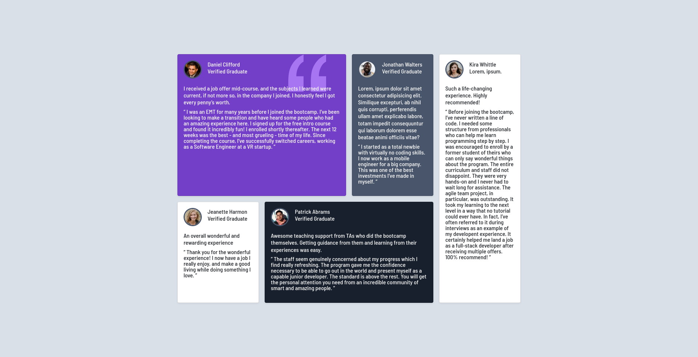

# Frontend Mentor - Testimonials grid section solution

This is a solution to the [Testimonials grid section challenge on Frontend Mentor](https://www.frontendmentor.io/challenges/testimonials-grid-section-Nnw6J7Un7). Frontend Mentor challenges help you improve your coding skills by building realistic projects. 

## Table of contents

- 
  - 
  - 
  - 
- 
  - 
  - 
  - 
- 
- 

## Overview

### The challenge

Users should be able to:

- View the optimal layout for the site depending on their device's screen size

### Screenshot

### Links

- Solution URL: 
- Live Site URL: 

## My process

### Built with

- Semantic HTML5 markup
- CSS custom properties
- Bootstrap  and Sass
- Mobile-first workflow

### Continued development

I liked bootstrap as it is a very easy and fast way to make designs, in the future I would like to learn another css framework and implement it with sass 

### Useful resources

-  - The official bootstrap documentation helped me a lot as a guide 

## Author

- Instagram -  
- Frontend Mentor - 

## Acknowledgments

This channel served me as a guide for my learning: 

